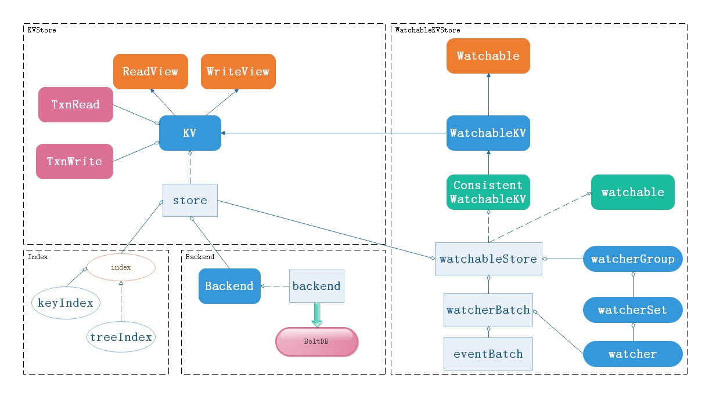
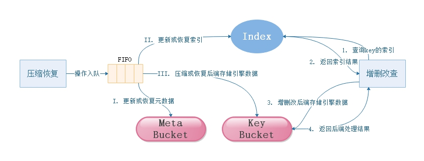

# etcd存储——存储架构

## etcd存储架构
etcd通常被用来存储分布式系统的重要元数据等，作为key-value存储器，etcd的存储实现方案便是其核心和重要的一环。  
etcd的存储方案实现定义在mvcc包中，主要提供了三种类型的存储API：
* KV：存储key-value对
* WatchableKV：存储可以监听变化的key-value对
* index：存储Key的索引

其中，KV和WatchableKV分别通过对应的kvStore和watchableStore实现存储，且这一部分API可被外部使用来操作etcd存储的数据；索引则通过keyIndex存储，这部分API仅提供给mvcc包存储索引，外部不可访问。  
etcd实现键值对存储的整体架构如下图所示。  

如图所示，etcd在存储键值对的设计中主要包含如下四部分：
* **KVStore** —— 主要用于实现一般地键值对存储和访问操作
* **WatchableKVStore** —— 主要用于实现可被客户端监听的键值对的存储、访问以及监听等操作
* **Index** —— 主要用于实现键值对的索引
* **Backend** —— 该接口主要用于实现与后端存储引擎的交互，通过实现该接口，etcd可以非常方便的切换后端存储引擎

## KVStore
KVStore用于实现存储和访问键值对，其通过KV接口向外暴露操作接口，而内部则通过一个数据结构store来具体实现键值对的增删改查、事务等操作。
### KV接口
KV接口是KVStore对外提供的核心接口，其继承了ReadView和WriteView接口分别实现对键值对的读写操作；通过TxnRead和TxnWrite接口实现对键值对的事务操作。这些接口的API定义如下：
* ReadView：定义了对键值对的读操作
    * FirstRev() int64：该方法在开启事务操作时返回第一个键值对版本；在压缩以后，第一个键值对版本更新为压缩的版本。
    * Rev() int64：该方法在开启事务操作时返回键值对的版本。
    * Range(ctx context.Context, key, end []byte, ro RangeOptions) (r *RangeResult, err error)：获取指定范围内的所有键值对。
        * 如果rangeRev <= 0，则返回当前版本所有的键值对；
        * 如果end为nil，则返回key指定的键值对；
        * 如果end不为nil且不为空，则返回[key, range_end)范围内指定的键值对；
        * 如果end不为nil，但为空，则返回所有大于等于key的键值对。
* WriteView：定义了对键值对的写操作
    * DeleteRange(key, end []byte) (n, rev int64)：从存储引擎中删除指定范围的键。
        * 如果end为nil，则删除key指定的键值对；
        * 如果end不为nil，则删除[key, range_end)范围内指定的键值对。
    * Put(key, value []byte, lease lease.LeaseID) (rev int64)：将指定的键值对保存到存储引擎中，该方法同时可以指定一个租期给对应的键值对。
* TxnRead：定义了一个只读的事务，并且不会阻塞其他读操作事务。该接口继承了ReadView的所有接口，同时还定义了如下事务操作方法：
    * End()：标识当前事务已经完成并准备提交。
* TxnWrite：定义了一个可以修改数据的事务，其继承了TxnRead事务，表示其是一个读写事务，也继承了WriteView的所有接口；同时，还定义了如下事务操作方法：
    * Changes() []mvccpb.KeyValue：当开启读写事务时，返回已经执行的变更。
* KV：其是etcd对外提供的键值对存储核心接口。其除了继承了ReadView和WriteView的所有读写操作外，还定义了如下API：
    * Read(trace *traceutil.Trace) TxnRead：创建一个只读事务。
    * Write(trace *traceutil.Trace) TxnWrite：创建一个读写事务。
    * Hash() (hash uint32, revision int64, err error)：计算KV后端存储的hash值。
    * HashByRev(rev int64) (hash uint32, revision int64, compactRev int64, err error)：计算到指定版本的所有MVCC版本的hash值。
    * Compact(trace *traceutil.Trace, rev int64) (<-chan struct{}, error)：释放小于rev的所有版本中待取代的键值对。
    * Commit()：将未提交的事务提交到后端存储引擎。
    * Restore(b backend.Backend) error：从后端存储中恢复KV存储数据。
    * Close() error：关闭KV存储。

### store
store是KV接口的具体实现，通过Backend接口与后端存储引擎交互实现数据存储。其实现原理如下图所示：  

在store中主要包含两类操作：一类是普通事务操作，包括对键值对的增删改查等；另一类是对数据的压缩、恢复等操作。  
对于普通事务操作，store的实现原理如下：
1. 首先通过index接口查询待处理的键值对的索引位置；
2. 根据查询到的索引结果找到对应后端的键值对进行操作。

而对于压缩和恢复数据，为了不阻塞普通事务操作，store借助一个FIFO调度队列来处理（恢复数据通常都是在重启etcd时操作，因此未入队，但其处理过程与压缩数据类似，故此也归为此类）：
1. 首先，store将相关的处理过程放入FIFO调度队列中
2. FIFO调度队列通过先进先出算法获取任务处理，处理时，遵循如下过程：
    1. 更新或恢复Meta Bucket中存储的元数据
    2. 更新或恢复index中的索引
    3. 压缩或恢复Key Bucket中保存的键值对

## WatchableKVStore
WatchableKVStore首先也是一种KVStore，其能实现KVStore的所有功能；除此之外，其通过watcher可以实现客户端对指定键值对的监听操作。
### WatchableKV
WatchableKV继承自KV接口，所以拥有KV接口提供的所有能力。另外，WatchableKV接口还定义了如下接口用于实现键值对的监听机制：
* NewWatchStream() WatchStream：创建一个监听流，用于实现监听事件

为了满足etcd的强一致性要求，WatchableKVStore在WatchableKV的基础上还定义了ConsistentWatchableKV接口，用于获取键值对的一致性索引。

### watchableStore
watchableStore是WatchableKV的一种实现，其继承了store的所有基本能力，另外还通过watcherGroup和watcherBatch维护了一组监听器和监听事件，通过这些监听器和监听事件可将键值对的变更及时通知给客户端。对于etcd的watch机制，后面会用单独的章节具体讨论，在此便不再赘述。

## Index
etcd存储索引的内部是通过一个index接口及其对应实现的数据结构来实现的，这部分内容，后续也会使用单独的章节来进行介绍，这里也不再进行详细说明。

## Backend
不管是KVStore还是WatchableKVStore，都只是etcd存储数据的中间模块，最终其都是通过Backend接口将数据保存到后端的存储引擎。Backend接口提供了如下API来实现对后端存储引擎的操作：
* ReadTx() ReadTx：返回一个读事务
* BatchTx() BatchTx：返回一个批量读写事务
* ConcurrentReadTx() ReadTx：返回一个非阻塞的读事务
* Snapshot() Snapshot：创建一个数据快照
* Hash(ignores map\[IgnoreKey\]struct{}) (uint32, error)：获取数据的Hash值
* Size() int64：返回当前后端数据库分配的物理存储空间大小。Backend接口保存了当前还未使用的数据库存储空间，其可以用来进行预分配或回收未使用的空间备用
* SizeInUse() int64：返回当前已使用的数据库存储空间大小
* OpenReadTxN() int64：返回当前打开的读事务数量
* Defrag() error：存储空间碎片整理
* ForceCommit()：提交事务，写入数据库
* Close() error：关闭后端数据库

当前，etcd通过backend实现Backend接口，在backend数据结构中，则通过BoltDB存储引擎来实现数据存储。
